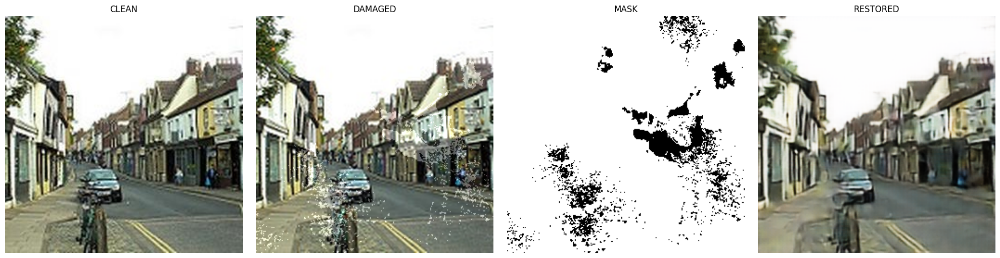
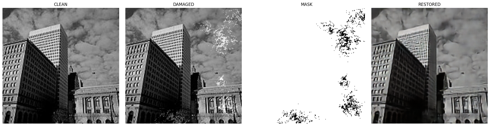
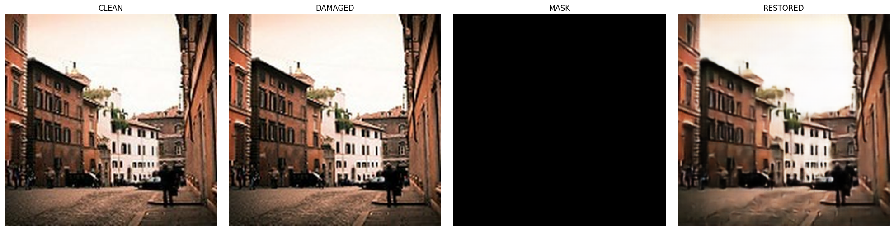
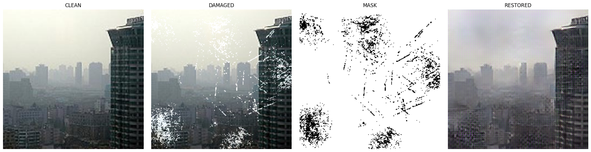
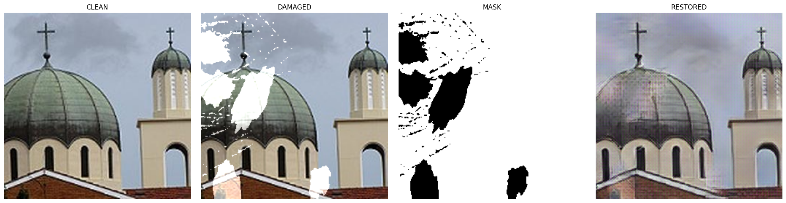
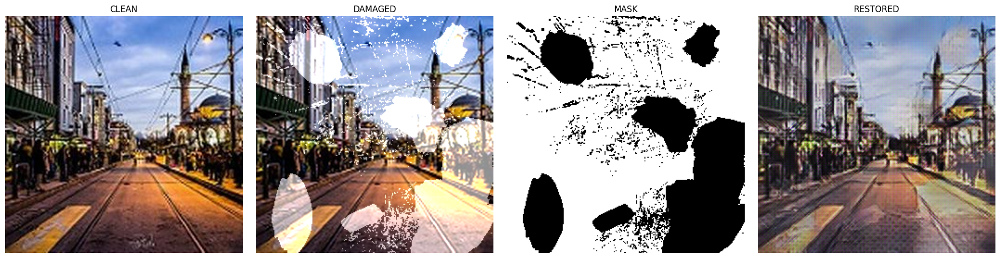
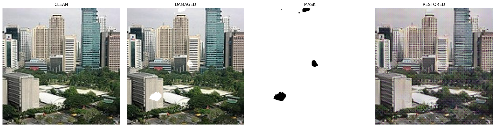
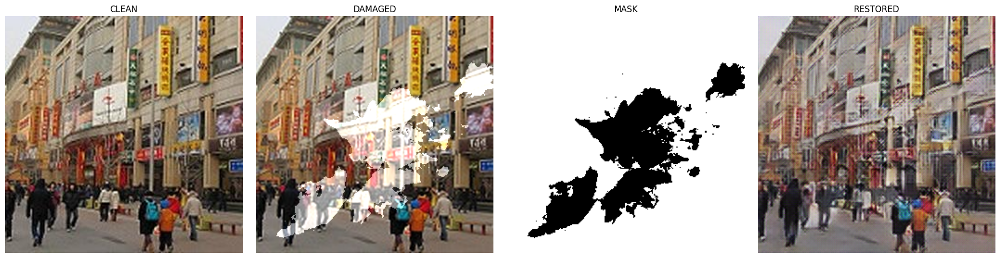
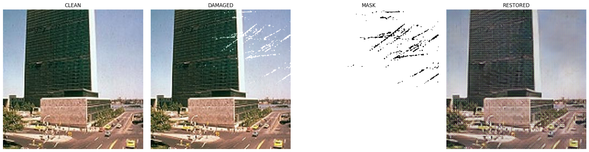

# 🎞️ Image Restoration using U-Net & Perceptual Loss

An advanced Deep Learning project aimed at restoring heavily damaged images by removing synthetic and natural film defects, such as scratches, dirt, spots, stains, and smut. 

This repository explores the intricacies of image restoration using a **ResNet U-Net** architecture and directly confronts the well-documented **Perception-Distortion Tradeoff** by comparing mathematically optimal loss functions (L1) against perceptually optimal loss functions (VGG16 Perceptual & SSIM).

---

## 📖 Project Overview

When dealing with historical film or damaged photographs, digital restoration is a highly complex task. Traditional convolutional networks trained with standard pixel-wise loss functions (like L1 or L2) tend to produce blurry images. They average out the uncertainty of high-frequency textures, destroying the natural "feel" of the image.

**The Goal:** Build an architecture that not only removes the damage but also synthesizes the underlying textures (e.g., bricks, road gravel) to make the image look sharp and realistic to the human eye.

---

## 🏗️ Model Architecture

The core architecture relies on a **ResNet U-Net** structure, heavily utilizing transfer learning to bootstrap the network's understanding of natural images.

### 1. The Encoder (ResNet-34 Feature Extractor)
The contracting path utilizes a pretrained **ResNet** backbone. Because this model was trained on millions of images (ImageNet), it already possesses a deep semantic understanding of natural image features, edges, and object structures. 
- During the initial training phase, the weights of this encoder are **frozen**. It acts purely as a robust feature extractor, interpreting the corrupted image without destroying its pretrained weights.

### 2. The Decoder (U-Net Upsampling)
The expansive path consists of transposed convolutions that rebuild the spatial resolution of the image.
- **Skip Connections:** The key to the U-Net's success. High-resolution, early-layer feature maps from the ResNet encoder are concatenated directly with the upsampled features in the decoder. This allows the model to perfectly retain spatial details (like the sharp corner of a window) while the network focuses purely on generating repaired pixels over the damaged areas.

---

## 🔬 The Perception-Distortion Tradeoff & Loss Functions

This project acts as an ablation study of the **Perception-Distortion Tradeoff**. We trained three separate models for 50 epochs each, isolated by their loss functions:

### 1. Baseline Model (L1 / Mean Absolute Error Loss)
- **Mechanism:** Computes the absolute pixel-by-pixel difference between the restored image and the ground truth.
- **Result:** Achieves the best mathematical scores (highest PSNR). However, it heavily penalizes any deviation in high-frequency textures. To minimize the error, the model "plays it safe" and outputs a blurry, smoothed average of complex textures.

### 2. Perceptual Model (VGG16 Feature Loss)
- **Mechanism:** Instead of comparing raw pixels, this loss feeds both the restored image and the clean image into a secondary, pretrained **VGG16 network**. It extracts deep feature maps from 5 specific ReLU layers. The loss is calculated as the distance between these feature maps (content) and their Gram matrices (style).
- **Result:** Forces the model to synthesize highly realistic and sharp textures. However, because these hallucinated textures don't align pixel-for-pixel with the original, mathematical metrics like PSNR inherently drop.

### 3. Perceptual + SSIM Loss Model
- **Mechanism:** Combines the VGG16 Perceptual loss with a **Structural Similarity Index (SSIM)** loss. The SSIM loss calculates the structural integrity, luminance, and contrast within a 5x5 sliding Gaussian window.
- **Result:** Explicitly forces the model to preserve sharp edges and local structures. It yields the best qualitative visual results, balancing realistic texture generation with structural preservation. 
- *Note: Due to the complex mathematical landscape of combining feature-loss and SSIM-loss, this model requires significantly more training epochs to fully converge compared to the pure L1 baseline.*

---

## 📊 Dataset Synthesis

The model was trained on a custom dataset of **7,000+ images** generated via a specialized pipeline.
- Clean images were sourced from urban environments (Buildings and Streets).
- Images were synthetically corrupted with "Light" and "Medium" severity artifacts to simulate real-world film damage (Dirt, Scratches, Smut, Spots, Stains, and Sprinkles).
- A 70/15/15 train-validation-test split was enforced.

---

## 📈 Quantitative Evaluation

As expected by the Perception-Distortion tradeoff, the Baseline model dominates the mathematical metrics, while the Perceptual models sacrifice pixel-wise accuracy for visual sharpness.

| Metric | Damaged Input | Baseline Model (L1) | Perceptual (P1) | SSIM Model |
|--------|---------------|----------------|-----------------|------------|
| **PSNR** | 20.91 | **24.14** | 18.35 | 18.77 |
| **SSIM** | 0.850 | **0.787** | 0.569 | 0.606 |
| **MAE** | 0.047 | **0.043** | 0.096 | 0.091 |
| **MSE** | 0.018 | **0.004** | 0.015 | 0.013 |

---

## 🖼️ Qualitative Results (Visual Comparisons)

*(Format: Clean Image | Damaged Image | Damage Mask | Restored Output)*

### 1. Baseline Model (L1 Loss)
*Notice the slight blurring and "watercolor" smoothing effect in heavily textured areas (over-smoothed to minimize pixel error).*

| Sample 1 | Sample 2 | Sample 3 |
|:---:|:---:|:---:|
|  |  |  |

### 2. Perceptual Model (VGG16 Loss)
*Notice the improved texture synthesis and sharper details. The model actively tries to reconstruct realistic surfaces.*

| Sample 1 | Sample 2 | Sample 3 |
|:---:|:---:|:---:|
|  |  |  |

### 3. SSIM + Perceptual Model
*The best qualitative performer. It balances realistic texture generation with structural preservation (preventing edges from becoming warped).*

| Sample 1 | Sample 2 | Sample 3 |
|:---:|:---:|:---:|
|  |  |  |

---
